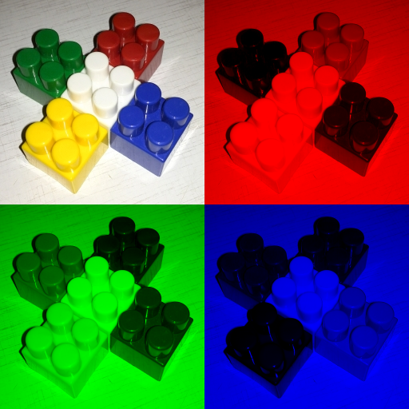

## Работа 2. Исследование каналов и JPEG-сжатия
автор: Измайлов Л.С.
дата: 2022-02-13T22:39:01

<!-- url: https://gitlab.com/2021-misis-spring/polevoy_d_v/-/tree/master/prj.labs/lab02 -->

### Задание
1. В качестве тестового использовать изображение data/cross_0256x0256.png
2. Сохранить тестовое изображение в формате JPEG с качеством 25%.
3. Используя cv::merge и cv::split сделать "мозаику" с визуализацией каналов для исходного тестового изображения и JPEG-версии тестового изображения
- левый верхний - трехканальное изображение
- левый нижний - монохромная (черно-зеленая) визуализация канала G
- правый верхний - монохромная (черно-красная) визуализация канала R
- правый нижний - монохромная (черно-синяя) визуализация канала B
4. Результы сохранить для вставки в отчет
5. Сделать мозаику из визуализации гистограммы для исходного тестового изображения и JPEG-версии тестового изображения, сохранить для вставки в отчет.

### Результаты

\
Рис. 1. Тестовое изображение после сохранения в формате JPEG с качеством 25%

\
Рис. 2. Визуализация каналов исходного тестового изображения

\
Рис. 3. Визуализация каналов JPEG-версии тестового изображения

\
Рис. 4. Визуализация гистограм исходного и JPEG-версии тестового изображения

### Текст программы

```cpp
#include <opencv2/opencv.hpp>

int main() {
	cv::Mat img = cv::imread("D:/University/izmailov_l_s/data/cross_0256x0256.png");
	std::vector<int> compression_params;
	compression_params.push_back(cv::IMWRITE_JPEG_QUALITY);
	compression_params.push_back(25);
	cv::imwrite("cross_0256x0256_025.jpg", img, compression_params);
	cv::waitKey();
}
```
