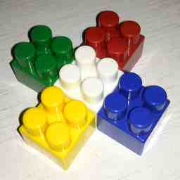
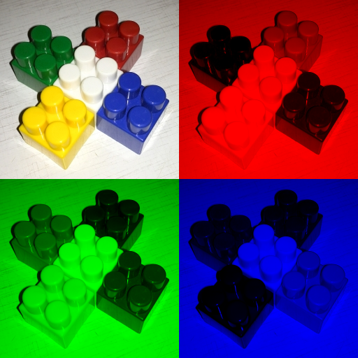

## Работа 2. Исследование каналов и JPEG-сжатия
автор: Измайлов Л.С.
дата: 2022-02-14T21:10:09

url: https://github.com/Izlaster/izmailov_l_s/tree/main/prj.labs/lab02

### Задание
1. В качестве тестового использовать изображение data/cross_0256x0256.png
2. Сохранить тестовое изображение в формате JPEG с качеством 25%.
3. Используя cv::merge и cv::split сделать "мозаику" с визуализацией каналов для исходного тестового изображения и JPEG-версии тестового изображения
- левый верхний - трехканальное изображение
- левый нижний - монохромная (черно-зеленая) визуализация канала G
- правый верхний - монохромная (черно-красная) визуализация канала R
- правый нижний - монохромная (черно-синяя) визуализация канала B
4. Результы сохранить для вставки в отчет
5. Сделать мозаику из визуализации гистограммы для исходного тестового изображения и JPEG-версии тестового изображения, сохранить для вставки в отчет.

### Результаты


Рис. 1. Тестовое изображение после сохранения в формате JPEG с качеством 25%


Рис. 2. Визуализация каналов исходного тестового изображения


Рис. 3. Визуализация каналов JPEG-версии тестового изображения


Рис. 3. Визуализация гистограм исходного и JPEG-версии тестового изображения

### Текст программы

```cpp
#include <opencv2/opencv.hpp>

void getHistNum(cv::Mat img, int* mas) {
	for (int i = 0; i < img.rows * img.cols; i++) {
		mas[i] = 0;
	}
	for (int i = 0; i < img.rows; i++) {
		for (int j = 0; j < img.cols; j++) {
			mas[img.at<uint8_t>(i, j)]++;
		}
	}
}

int main() {
	cv::Mat imgPng = cv::imread("../data/cross_0256x0256.png");

	std::vector<int> compression_params;
	compression_params.push_back(cv::IMWRITE_JPEG_QUALITY);
	compression_params.push_back(25);
	cv::imwrite("cross_0256x0256_025.jpg", imgPng, compression_params);

	cv::Mat channelsPNG[3];
	cv::split(imgPng, channelsPNG);
	
	cv::Mat zeroChannel(256, 256, CV_8UC1);
	zeroChannel = 0;

	cv::Mat mergeImg_png;
	cv::merge(channelsPNG, 3, mergeImg_png);

	cv::Mat m1, m2, mazaika_png;

	cv::Mat monoB_png[3] = { channelsPNG[0], zeroChannel, zeroChannel };
	cv::Mat monoG_png[3] = { zeroChannel, channelsPNG[1], zeroChannel };
	cv::Mat monoR_png[3] = { zeroChannel, zeroChannel, channelsPNG[2] };

	cv::Mat mergeImgB_png, mergeImgG_png, mergeImgR_png;
	cv::merge(monoB_png, 3, mergeImgB_png);
	cv::merge(monoG_png, 3, mergeImgG_png);
	cv::merge(monoR_png, 3, mergeImgR_png);

	cv::hconcat(mergeImg_png, mergeImgR_png, m1);
	cv::hconcat(mergeImgG_png, mergeImgB_png, m2);
	cv::vconcat(m1, m2, mazaika_png);
	cv::imwrite("cross_0256x0256_png_channels.png", mazaika_png);
	cv::imshow("cross_0256x0256_png_channels.png", mazaika_png);

	compression_params.pop_back();
	compression_params.push_back(100);
	cv::imwrite("cross_0256x0256_100.jpg", imgPng, compression_params);

	cv::Mat imgJpg = cv::imread("cross_0256x0256_100.jpg");
	cv::Mat channelsJPG[3];
	cv::split(imgJpg, channelsJPG);

	cv::Mat mergeImg_jpg;
	cv::merge(channelsJPG, 3, mergeImg_jpg);

	cv::Mat mazaika_jpg;

	cv::Mat monoB_jpg[3] = { channelsJPG[0], zeroChannel, zeroChannel };
	cv::Mat monoG_jpg[3] = { zeroChannel, channelsJPG[1], zeroChannel };
	cv::Mat monoR_jpg[3] = { zeroChannel, zeroChannel, channelsJPG[2] };

	cv::Mat mergeImgB_jpg, mergeImgG_jpg, mergeImgR_jpg;
	cv::merge(monoB_png, 3, mergeImgB_jpg);
	cv::merge(monoG_png, 3, mergeImgG_jpg);
	cv::merge(monoR_png, 3, mergeImgR_jpg);

	cv::hconcat(mergeImg_jpg, mergeImgR_jpg, m1);
	cv::hconcat(mergeImgG_jpg, mergeImgB_jpg, m2);
	cv::vconcat(m1, m2, mazaika_jpg);
	cv::imwrite("cross_0256x0256_jpg_channels.png", mazaika_jpg);

	int countBp[256];
	int countGp[256];
	int countRp[256];

	getHistNum(channelsPNG[0], countBp);
	getHistNum(channelsPNG[1], countGp);
	getHistNum(channelsPNG[2], countRp);

	for (size_t i = 0; i < 256; i++)
	{
		std::cout << i << " " << countBp[i] << std::endl;
	}

	cv::waitKey(0);
}
```
